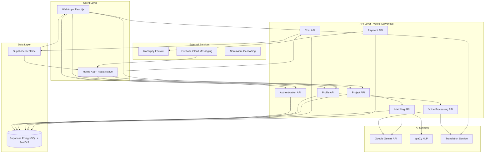
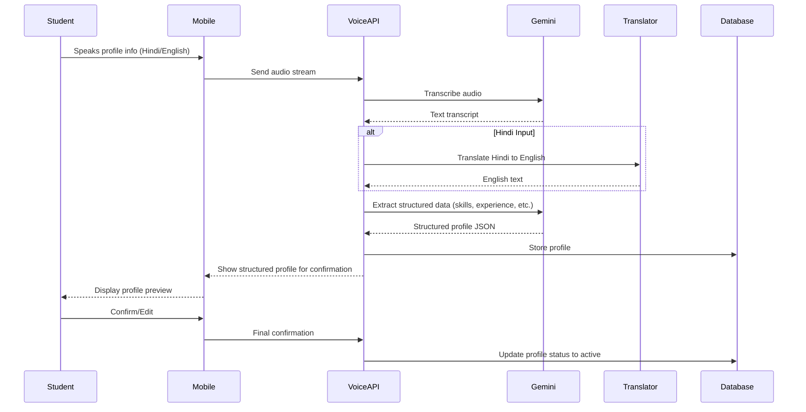
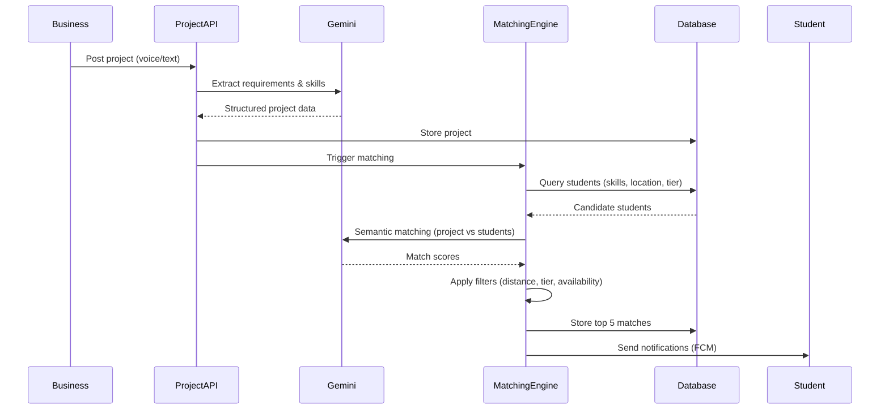

# Design Document: Student-Freelance Platform

## Overview

The Student-Freelance Platform is a voice-first, hyperlocal marketplace connecting 50M college students with 60M businesses across India. The platform leverages AI-powered semantic matching, multilingual support (Hindi ↔ English), and comprehensive verification systems to achieve an 87% project success rate.

### Key Design Principles

1. **Voice-First Architecture**: All user interactions prioritize voice input with text as a fallback
2. **Hyperlocal Matching**: PostGIS-powered geospatial queries within 5-10km radius
3. **AI-Driven Intelligence**: Semantic understanding over keyword matching using Google Gemini API
4. **Serverless Scalability**: Vercel serverless functions for auto-scaling to handle millions of users
5. **Real-Time Communication**: Supabase Realtime for instant messaging and notifications
6. **Payment Security**: Razorpay escrow system with milestone-based releases

### Technology Stack

- **Frontend**: React.js (web), React Native (mobile), Tailwind CSS
- **Backend**: Vercel Serverless Functions (Node.js)
- **Database**: Supabase (PostgreSQL + PostGIS for geospatial)
- **AI/ML**: Google Gemini API (matching, NLP), spaCy (text processing)
- **Payments**: Razorpay (escrow, milestone payments)
- **Communication**: Supabase Realtime, Firebase Cloud Messaging
- **Search**: PostgreSQL Full-Text Search with tsvector
- **Location**: PostGIS (geospatial queries), Nominatim (geocoding)
- **Monitoring**: Vercel Analytics, Sentry (error tracking)

## Architecture

### System Architecture



### Data Flow: Voice Profile Creation



### Data Flow: AI-Powered Project Matching



## Components and Interfaces

### 1. Voice Processing Service

**Responsibility**: Convert voice input to structured data, handle transcription and translation

**Interface**:
```typescript
interface VoiceProcessingService {
  // Transcribe audio to text
  transcribeAudio(audioBlob: Blob, language: 'hi' | 'en'): Promise<TranscriptionResult>;
  
  // Extract structured profile data from voice input
  extractProfileData(transcript: string): Promise<ProfileData>;
  
  // Extract project requirements from voice input
  extractProjectData(transcript: string): Promise<ProjectData>;
  
  // Validate extracted data completeness
  validateExtraction(data: ProfileData | ProjectData): ValidationResult;
}

interface TranscriptionResult {
  text: string;
  language: 'hi' | 'en';
  confidence: number;
  timestamp: Date;
}

interface ProfileData {
  name: string;
  skills: string[];
  experience: string;
  education: string;
  availability: string;
  missingFields: string[];
}

interface ProjectData {
  title: string;
  description: string;
  requiredSkills: string[];
  budget: number;
  timeline: string;
  milestones: Milestone[];
  missingFields: string[];
}
```

**Implementation Notes**:
- Use Google Gemini API for transcription and structured extraction
- Implement retry logic for API failures
- Cache common skill extractions to reduce API calls
- Store raw transcripts for audit purposes

### 2. Translation Service

**Responsibility**: Bidirectional translation between Hindi and English

**Interface**:
```typescript
interface TranslationService {
  // Translate text between Hindi and English
  translate(text: string, from: 'hi' | 'en', to: 'hi' | 'en'): Promise<TranslationResult>;
  
  // Batch translate multiple messages
  batchTranslate(messages: Message[], targetLanguage: 'hi' | 'en'): Promise<TranslationResult[]>;
  
  // Detect language of input text
  detectLanguage(text: string): Promise<'hi' | 'en'>;
}

interface TranslationResult {
  originalText: string;
  translatedText: string;
  sourceLanguage: 'hi' | 'en';
  targetLanguage: 'hi' | 'en';
  confidence: number;
}
```

**Implementation Notes**:
- Use Google Gemini API for translation
- Implement caching for common phrases
- Store both original and translated text in database
- Handle mixed language input (code-switching)

### 3. AI Matching Engine

**Responsibility**: Semantic matching between projects and students

**Interface**:
```typescript
interface MatchingEngine {
  // Find top 5 students for a project
  matchStudentsToProject(projectId: string): Promise<MatchResult[]>;
  
  // Calculate match score between student and project
  calculateMatchScore(studentId: string, projectId: string): Promise<number>;
  
  // Apply filters (location, tier, availability)
  applyFilters(candidates: Student[], project: Project): Student[];
  
  // Semantic skill matching
  matchSkills(requiredSkills: string[], studentSkills: string[]): SkillMatchResult;
}

interface MatchResult {
  studentId: string;
  matchScore: number;
  skillMatch: number;
  locationDistance: number;
  availabilityMatch: boolean;
  tierMatch: boolean;
  reasoning: string;
}

interface SkillMatchResult {
  matchedSkills: string[];
  missingSkills: string[];
  overallScore: number;
  semanticMatches: { required: string; student: string; confidence: number }[];
}
```

**Implementation Notes**:
- Use Google Gemini API for semantic understanding
- Use spaCy for skill synonym detection
- Implement weighted scoring: skills (40%), location (30%), tier (20%), success rate (10%)
- Cache match scores for 1 hour to reduce computation

### 4. Hyperlocal Matching Service

**Responsibility**: Geospatial queries and distance calculations

**Interface**:
```typescript
interface HyperlocalService {
  // Find students within radius
  findStudentsNearby(location: GeoPoint, radiusKm: number): Promise<Student[]>;
  
  // Calculate distance between two points
  calculateDistance(point1: GeoPoint, point2: GeoPoint): number;
  
  // Geocode address to coordinates
  geocodeAddress(address: string): Promise<GeoPoint>;
  
  // Reverse geocode coordinates to address
  reverseGeocode(location: GeoPoint): Promise<string>;
}

interface GeoPoint {
  latitude: number;
  longitude: number;
}
```

**Implementation Notes**:
- Use PostGIS ST_DWithin for efficient radius queries
- Use PostGIS ST_Distance for distance calculations
- Use Nominatim for geocoding (with rate limiting)
- Create spatial index on student and business locations
- Query pattern: first 5km, then expand to 10km if insufficient matches

### 5. Verification Service

**Responsibility**: Manage student skill tiers and business verification levels

**Interface**:
```typescript
interface VerificationService {
  // Student verification
  verifyStudentSkill(studentId: string, skill: string, evidence: Evidence): Promise<SkillTier>;
  updateSkillTier(studentId: string, skill: string, newTier: SkillTier): Promise<void>;
  detectPlagiarism(portfolioItem: PortfolioItem): Promise<PlagiarismResult>;
  
  // Business verification
  verifyBusiness(businessId: string, documents: Document[]): Promise<BusinessTier>;
  updateBusinessTier(businessId: string, newTier: BusinessTier): Promise<void>;
  trackBusinessBehavior(businessId: string, event: BehaviorEvent): Promise<void>;
}

type SkillTier = '⭐' | '⭐⭐' | '⭐⭐⭐' | '⭐⭐⭐⭐';
type BusinessTier = 'Unverified' | 'Verified' | 'Premium';

interface Evidence {
  type: 'test' | 'project' | 'portfolio';
  data: any;
}

interface PlagiarismResult {
  isPlagiarized: boolean;
  confidence: number;
  sources: string[];
}

interface BehaviorEvent {
  type: 'dispute' | 'late_payment' | 'project_success' | 'project_failure';
  projectId: string;
  timestamp: Date;
}
```

**Implementation Notes**:
- Use AI to analyze portfolio items for authenticity
- Implement skill tier progression: ⭐ (claimed) → ⭐⭐ (test passed) → ⭐⭐⭐ (1-3 projects) → ⭐⭐⭐⭐ (4+ projects)
- Track business behavior score: +10 for success, -20 for dispute, -30 for late payment
- Auto-downgrade business tier if behavior score drops below threshold

### 6. Escrow Payment Service

**Responsibility**: Manage milestone-based payments with escrow protection

**Interface**:
```typescript
interface EscrowService {
  // Create escrow for project
  createEscrow(projectId: string, totalAmount: number, milestones: Milestone[]): Promise<Escrow>;
  
  // Fund escrow
  fundEscrow(escrowId: string, paymentMethod: PaymentMethod): Promise<FundingResult>;
  
  // Release milestone payment
  releaseMilestonePayment(escrowId: string, milestoneId: string): Promise<PaymentResult>;
  
  // Handle dispute
  handleDispute(escrowId: string, milestoneId: string, dispute: Dispute): Promise<DisputeResult>;
  
  // Refund escrow
  refundEscrow(escrowId: string, reason: string): Promise<RefundResult>;
}

interface Escrow {
  id: string;
  projectId: string;
  totalAmount: number;
  remainingAmount: number;
  status: 'pending' | 'funded' | 'partial' | 'completed' | 'refunded';
  milestones: Milestone[];
}

interface Milestone {
  id: string;
  description: string;
  amount: number;
  dueDate: Date;
  status: 'pending' | 'in_progress' | 'submitted' | 'approved' | 'disputed' | 'paid';
}

interface PaymentResult {
  success: boolean;
  transactionId: string;
  amount: number;
  platformFee: number;
  netAmount: number;
  timestamp: Date;
}
```

**Implementation Notes**:
- Integrate with Razorpay for payment processing
- Calculate platform fees: 5% (Premium), 10% (Verified), 15% (Unverified)
- Hold funds in Razorpay escrow account
- Release payments within 24 hours of approval
- Implement automatic refund for cancelled projects

### 7. Real-Time Chat Service

**Responsibility**: Handle messaging with translation support

**Interface**:
```typescript
interface ChatService {
  // Send message
  sendMessage(chatId: string, senderId: string, content: string, language: 'hi' | 'en'): Promise<Message>;
  
  // Get chat history
  getChatHistory(chatId: string, limit: number, offset: number): Promise<Message[]>;
  
  // Subscribe to real-time messages
  subscribeToChat(chatId: string, callback: (message: Message) => void): Subscription;
  
  // Mark messages as read
  markAsRead(chatId: string, userId: string): Promise<void>;
}

interface Message {
  id: string;
  chatId: string;
  senderId: string;
  originalText: string;
  translatedText: string | null;
  originalLanguage: 'hi' | 'en';
  timestamp: Date;
  isRead: boolean;
}
```

**Implementation Notes**:
- Use Supabase Realtime for WebSocket connections
- Translate messages on send (not on receive) to reduce latency
- Store both original and translated text
- Implement message pagination (50 messages per page)
- Use Firebase Cloud Messaging for push notifications when user is offline

### 8. Notification Service

**Responsibility**: Send push notifications and in-app alerts

**Interface**:
```typescript
interface NotificationService {
  // Send push notification
  sendPushNotification(userId: string, notification: Notification): Promise<void>;
  
  // Send batch notifications
  sendBatchNotifications(notifications: { userId: string; notification: Notification }[]): Promise<void>;
  
  // Get user notification preferences
  getPreferences(userId: string): Promise<NotificationPreferences>;
  
  // Update notification preferences
  updatePreferences(userId: string, preferences: NotificationPreferences): Promise<void>;
}

interface Notification {
  title: string;
  body: string;
  type: 'match' | 'message' | 'milestone' | 'payment' | 'dispute' | 'reminder';
  data: any;
  priority: 'high' | 'normal' | 'low';
}

interface NotificationPreferences {
  pushEnabled: boolean;
  emailEnabled: boolean;
  types: {
    match: boolean;
    message: boolean;
    milestone: boolean;
    payment: boolean;
    dispute: boolean;
    reminder: boolean;
  };
}
```

**Implementation Notes**:
- Use Firebase Cloud Messaging for mobile push notifications
- Implement notification batching to avoid spam
- Respect user preferences and quiet hours
- Send notifications within 1 minute of event
- Track notification delivery and open rates

## Data Models

### Student Profile

```typescript
interface Student {
  id: string;
  name: string;
  email: string;
  phone: string;
  location: GeoPoint;
  address: string;
  preferredLanguage: 'hi' | 'en';
  
  // Skills and verification
  skills: StudentSkill[];
  education: string;
  experience: string;
  availability: 'full-time' | 'part-time' | 'weekends';
  
  // Portfolio
  portfolio: PortfolioItem[];
  
  // Reputation
  successRate: number;
  completedProjects: number;
  totalEarnings: number;
  rating: number;
  reviews: Review[];
  
  // Metadata
  createdAt: Date;
  updatedAt: Date;
  isActive: boolean;
  lastActiveAt: Date;
}

interface StudentSkill {
  name: string;
  tier: SkillTier;
  verifiedAt: Date | null;
  projectCount: number;
  testScore: number | null;
}

interface PortfolioItem {
  id: string;
  title: string;
  description: string;
  skills: string[];
  images: string[];
  links: string[];
  projectId: string | null;
  createdAt: Date;
  isPlagiarized: boolean;
}
```

**Database Schema (PostgreSQL)**:
```sql
CREATE TABLE students (
  id UUID PRIMARY KEY DEFAULT gen_random_uuid(),
  name VARCHAR(255) NOT NULL,
  email VARCHAR(255) UNIQUE NOT NULL,
  phone VARCHAR(20) UNIQUE NOT NULL,
  location GEOGRAPHY(POINT, 4326) NOT NULL,
  address TEXT,
  preferred_language VARCHAR(2) DEFAULT 'en',
  education TEXT,
  experience TEXT,
  availability VARCHAR(20),
  success_rate DECIMAL(5,2) DEFAULT 0,
  completed_projects INTEGER DEFAULT 0,
  total_earnings DECIMAL(10,2) DEFAULT 0,
  rating DECIMAL(3,2) DEFAULT 0,
  created_at TIMESTAMP DEFAULT NOW(),
  updated_at TIMESTAMP DEFAULT NOW(),
  is_active BOOLEAN DEFAULT true,
  last_active_at TIMESTAMP DEFAULT NOW()
);

CREATE INDEX idx_students_location ON students USING GIST(location);
CREATE INDEX idx_students_email ON students(email);

CREATE TABLE student_skills (
  id UUID PRIMARY KEY DEFAULT gen_random_uuid(),
  student_id UUID REFERENCES students(id) ON DELETE CASCADE,
  skill_name VARCHAR(100) NOT NULL,
  tier VARCHAR(10) NOT NULL,
  verified_at TIMESTAMP,
  project_count INTEGER DEFAULT 0,
  test_score INTEGER,
  created_at TIMESTAMP DEFAULT NOW(),
  UNIQUE(student_id, skill_name)
);

CREATE INDEX idx_student_skills_student ON student_skills(student_id);
CREATE INDEX idx_student_skills_name ON student_skills(skill_name);

CREATE TABLE portfolio_items (
  id UUID PRIMARY KEY DEFAULT gen_random_uuid(),
  student_id UUID REFERENCES students(id) ON DELETE CASCADE,
  title VARCHAR(255) NOT NULL,
  description TEXT,
  skills TEXT[],
  images TEXT[],
  links TEXT[],
  project_id UUID,
  is_plagiarized BOOLEAN DEFAULT false,
  created_at TIMESTAMP DEFAULT NOW()
);

CREATE INDEX idx_portfolio_student ON portfolio_items(student_id);
```

### Business Profile

```typescript
interface Business {
  id: string;
  name: string;
  email: string;
  phone: string;
  location: GeoPoint;
  address: string;
  preferredLanguage: 'hi' | 'en';
  
  // Verification
  verificationTier: BusinessTier;
  verificationDocuments: string[];
  verifiedAt: Date | null;
  
  // Reputation
  completedProjects: number;
  totalSpent: number;
  rating: number;
  reviews: Review[];
  behaviorScore: number;
  disputes: number;
  
  // Metadata
  createdAt: Date;
  updatedAt: Date;
  isActive: boolean;
  lastActiveAt: Date;
}
```

**Database Schema (PostgreSQL)**:
```sql
CREATE TABLE businesses (
  id UUID PRIMARY KEY DEFAULT gen_random_uuid(),
  name VARCHAR(255) NOT NULL,
  email VARCHAR(255) UNIQUE NOT NULL,
  phone VARCHAR(20) UNIQUE NOT NULL,
  location GEOGRAPHY(POINT, 4326) NOT NULL,
  address TEXT,
  preferred_language VARCHAR(2) DEFAULT 'en',
  verification_tier VARCHAR(20) DEFAULT 'Unverified',
  verification_documents TEXT[],
  verified_at TIMESTAMP,
  completed_projects INTEGER DEFAULT 0,
  total_spent DECIMAL(10,2) DEFAULT 0,
  rating DECIMAL(3,2) DEFAULT 0,
  behavior_score INTEGER DEFAULT 100,
  disputes INTEGER DEFAULT 0,
  created_at TIMESTAMP DEFAULT NOW(),
  updated_at TIMESTAMP DEFAULT NOW(),
  is_active BOOLEAN DEFAULT true,
  last_active_at TIMESTAMP DEFAULT NOW()
);

CREATE INDEX idx_businesses_location ON businesses USING GIST(location);
CREATE INDEX idx_businesses_email ON businesses(email);
CREATE INDEX idx_businesses_tier ON businesses(verification_tier);
```

### Project

```typescript
interface Project {
  id: string;
  businessId: string;
  
  // Project details
  title: string;
  description: string;
  requiredSkills: string[];
  budget: number;
  timeline: string;
  location: GeoPoint;
  
  // Milestones
  milestones: Milestone[];
  
  // Matching
  matchedStudents: string[];
  selectedStudentId: string | null;
  
  // Status
  status: 'draft' | 'open' | 'in_progress' | 'completed' | 'cancelled' | 'disputed';
  
  // Metadata
  createdAt: Date;
  updatedAt: Date;
  startedAt: Date | null;
  completedAt: Date | null;
}
```

**Database Schema (PostgreSQL)**:
```sql
CREATE TABLE projects (
  id UUID PRIMARY KEY DEFAULT gen_random_uuid(),
  business_id UUID REFERENCES businesses(id) ON DELETE CASCADE,
  title VARCHAR(255) NOT NULL,
  description TEXT NOT NULL,
  required_skills TEXT[] NOT NULL,
  budget DECIMAL(10,2) NOT NULL,
  timeline VARCHAR(100),
  location GEOGRAPHY(POINT, 4326) NOT NULL,
  matched_students UUID[],
  selected_student_id UUID REFERENCES students(id),
  status VARCHAR(20) DEFAULT 'draft',
  created_at TIMESTAMP DEFAULT NOW(),
  updated_at TIMESTAMP DEFAULT NOW(),
  started_at TIMESTAMP,
  completed_at TIMESTAMP
);

CREATE INDEX idx_projects_business ON projects(business_id);
CREATE INDEX idx_projects_status ON projects(status);
CREATE INDEX idx_projects_location ON projects USING GIST(location);
CREATE INDEX idx_projects_skills ON projects USING GIN(required_skills);

CREATE TABLE milestones (
  id UUID PRIMARY KEY DEFAULT gen_random_uuid(),
  project_id UUID REFERENCES projects(id) ON DELETE CASCADE,
  description TEXT NOT NULL,
  amount DECIMAL(10,2) NOT NULL,
  due_date TIMESTAMP NOT NULL,
  status VARCHAR(20) DEFAULT 'pending',
  submitted_at TIMESTAMP,
  approved_at TIMESTAMP,
  paid_at TIMESTAMP,
  created_at TIMESTAMP DEFAULT NOW()
);

CREATE INDEX idx_milestones_project ON milestones(project_id);
CREATE INDEX idx_milestones_status ON milestones(status);
```

### Escrow

```typescript
interface Escrow {
  id: string;
  projectId: string;
  businessId: string;
  studentId: string;
  
  // Amounts
  totalAmount: number;
  remainingAmount: number;
  platformFeePercentage: number;
  
  // Razorpay
  razorpayOrderId: string;
  razorpayPaymentId: string | null;
  
  // Status
  status: 'pending' | 'funded' | 'partial' | 'completed' | 'refunded';
  
  // Metadata
  createdAt: Date;
  fundedAt: Date | null;
  completedAt: Date | null;
}
```

**Database Schema (PostgreSQL)**:
```sql
CREATE TABLE escrows (
  id UUID PRIMARY KEY DEFAULT gen_random_uuid(),
  project_id UUID REFERENCES projects(id) ON DELETE CASCADE,
  business_id UUID REFERENCES businesses(id),
  student_id UUID REFERENCES students(id),
  total_amount DECIMAL(10,2) NOT NULL,
  remaining_amount DECIMAL(10,2) NOT NULL,
  platform_fee_percentage DECIMAL(5,2) NOT NULL,
  razorpay_order_id VARCHAR(255),
  razorpay_payment_id VARCHAR(255),
  status VARCHAR(20) DEFAULT 'pending',
  created_at TIMESTAMP DEFAULT NOW(),
  funded_at TIMESTAMP,
  completed_at TIMESTAMP
);

CREATE INDEX idx_escrows_project ON escrows(project_id);
CREATE INDEX idx_escrows_status ON escrows(status);
```

### Chat and Messages

```typescript
interface Chat {
  id: string;
  projectId: string;
  studentId: string;
  businessId: string;
  lastMessageAt: Date;
  createdAt: Date;
}

interface Message {
  id: string;
  chatId: string;
  senderId: string;
  senderType: 'student' | 'business';
  originalText: string;
  translatedText: string | null;
  originalLanguage: 'hi' | 'en';
  isRead: boolean;
  createdAt: Date;
}
```

**Database Schema (PostgreSQL)**:
```sql
CREATE TABLE chats (
  id UUID PRIMARY KEY DEFAULT gen_random_uuid(),
  project_id UUID REFERENCES projects(id) ON DELETE CASCADE,
  student_id UUID REFERENCES students(id),
  business_id UUID REFERENCES businesses(id),
  last_message_at TIMESTAMP DEFAULT NOW(),
  created_at TIMESTAMP DEFAULT NOW()
);

CREATE INDEX idx_chats_project ON chats(project_id);
CREATE INDEX idx_chats_student ON chats(student_id);
CREATE INDEX idx_chats_business ON chats(business_id);

CREATE TABLE messages (
  id UUID PRIMARY KEY DEFAULT gen_random_uuid(),
  chat_id UUID REFERENCES chats(id) ON DELETE CASCADE,
  sender_id UUID NOT NULL,
  sender_type VARCHAR(10) NOT NULL,
  original_text TEXT NOT NULL,
  translated_text TEXT,
  original_language VARCHAR(2) NOT NULL,
  is_read BOOLEAN DEFAULT false,
  created_at TIMESTAMP DEFAULT NOW()
);

CREATE INDEX idx_messages_chat ON messages(chat_id, created_at DESC);
CREATE INDEX idx_messages_sender ON messages(sender_id);
```

### Full-Text Search Configuration

```sql
-- Add tsvector column for full-text search on projects
ALTER TABLE projects ADD COLUMN search_vector tsvector;

-- Create function to update search vector
CREATE FUNCTION projects_search_vector_update() RETURNS trigger AS $$
BEGIN
  NEW.search_vector :=
    setweight(to_tsvector('english', COALESCE(NEW.title, '')), 'A') ||
    setweight(to_tsvector('english', COALESCE(NEW.description, '')), 'B') ||
    setweight(to_tsvector('english', COALESCE(array_to_string(NEW.required_skills, ' '), '')), 'C');
  RETURN NEW;
END;
$$ LANGUAGE plpgsql;

-- Create trigger
CREATE TRIGGER projects_search_vector_trigger
BEFORE INSERT OR UPDATE ON projects
FOR EACH ROW EXECUTE FUNCTION projects_search_vector_update();

-- Create GIN index for fast full-text search
CREATE INDEX idx_projects_search ON projects USING GIN(search_vector);
```


## Correctness Properties

A property is a characteristic or behavior that should hold true across all valid executions of a system—essentially, a formal statement about what the system should do. Properties serve as the bridge between human-readable specifications and machine-verifiable correctness guarantees.

### Property 1: Voice Transcription Preserves Meaning

*For any* voice input in Hindi or English, transcribing and then extracting structured data should preserve the semantic meaning of the original input.

**Validates: Requirements 1.1, 1.2, 1.3, 1.4**

### Property 2: Translation Round Trip

*For any* text message, translating from Hindi to English and back to Hindi (or English to Hindi to English) should produce semantically equivalent text.

**Validates: Requirements 5.1, 5.2**

### Property 3: Skill Tier Progression

*For any* student skill, the tier should only increase (never decrease) except when plagiarism is detected, and should follow the progression: ⭐ → ⭐⭐ → ⭐⭐⭐ → ⭐⭐⭐⭐.

**Validates: Requirements 2.1, 2.2, 2.3, 2.4, 2.6**

### Property 4: Hyperlocal Distance Filtering

*For any* project location and student location, if the distance between them exceeds 10km, the student should not appear in the matched results.

**Validates: Requirements 4.1, 4.2, 4.3**

### Property 5: Semantic Skill Matching

*For any* project requiring skills and any student with skills, if the student's skills are semantic synonyms of the required skills (e.g., "React" and "React.js"), the match score should reflect equivalence.

**Validates: Requirements 3.2, 15.1, 15.2**

### Property 6: Skill Tier Protection

*For any* project with required skill tier and any student, if the student's skill tier is below the required tier, the student should be excluded from the top 5 matches.

**Validates: Requirements 3.3, 15.3**

### Property 7: Escrow Fund Conservation

*For any* escrow account, the sum of all released milestone payments plus the remaining balance should always equal the total funded amount minus platform fees.

**Validates: Requirements 6.2, 6.3, 6.6, 14.2, 14.3**

### Property 8: Milestone Payment Release

*For any* approved milestone, the payment should be released within 24 hours, and the escrow remaining balance should decrease by the milestone amount.

**Validates: Requirements 6.4, 14.3**

### Property 9: Business Verification Tier Progression

*For any* business, the verification tier should progress from Unverified → Verified → Premium, and should only downgrade if disputes exceed threshold.

**Validates: Requirements 7.1, 7.2, 7.3, 7.5**

### Property 10: Project Extraction Completeness

*For any* natural language project description, the extracted structured data should contain at minimum: title, description, required skills, and budget.

**Validates: Requirements 8.1, 8.2, 8.6**

### Property 11: Portfolio Skill Validation

*For any* portfolio item claiming skills, the AI analysis should validate that the portfolio content demonstrates those skills.

**Validates: Requirements 2.5, 9.2**

### Property 12: Dispute Resolution Escrow Hold

*For any* disputed milestone, the escrow should hold the milestone payment until the dispute is resolved, and should not release it to either party during the dispute.

**Validates: Requirements 6.5, 10.2, 10.3, 10.4, 10.5**

### Property 13: Success Rate Calculation

*For any* student or business, the success rate should equal (completed projects / total projects) * 100, and should be between 0 and 100.

**Validates: Requirements 11.3, 12.5**

### Property 14: Skill Test Tier Update

*For any* student completing a skill test, if the test score exceeds the passing threshold, the skill tier should increase by at least one level.

**Validates: Requirements 2.2, 13.2**

### Property 15: Match Score Weighting

*For any* student-project match, the match score should be calculated as: (skills_match * 0.4) + (location_score * 0.3) + (tier_match * 0.2) + (success_rate * 0.1), and should be between 0 and 100.

**Validates: Requirements 3.1, 3.4, 3.5, 3.6**

### Property 16: Top 5 Matches Ordering

*For any* project, the top 5 matched students should be ordered by descending match score, with the highest score first.

**Validates: Requirements 3.1**

### Property 17: Notification Delivery Timing

*For any* match event, the notification should be sent to matched students within 5 minutes of the project being posted.

**Validates: Requirements 3.7, 17.1**

### Property 18: Real-Time Message Translation

*For any* chat message, if the sender and receiver have different preferred languages, the message should be translated and both original and translated versions should be stored.

**Validates: Requirements 5.1, 5.2, 5.3, 5.6**

### Property 19: Search Result Relevance

*For any* search query, all returned results should contain at least one term from the query in the title, description, or required skills.

**Validates: Requirements 18.1, 18.2**

### Property 20: Platform Fee Calculation

*For any* payment release, the platform fee should be calculated as: (milestone_amount * fee_percentage), where fee_percentage is 5% for Premium, 10% for Verified, and 15% for Unverified businesses.

**Validates: Requirements 19.2, 19.4**

### Property 21: Reputation Score Bounds

*For any* student or business, the reputation score should be between 0 and 5, and should be calculated as the average of all received ratings.

**Validates: Requirements 20.2, 20.3**

### Property 22: Behavior Score Impact

*For any* business, completing a successful project should increase behavior score by 10, a dispute should decrease it by 20, and late payment should decrease it by 30.

**Validates: Requirements 20.6, 7.4**

### Property 23: Location Update Triggers Rematch

*For any* student updating their location, all active project matches should be recalculated to reflect the new distance.

**Validates: Requirements 4.5**

### Property 24: Geospatial Distance Calculation

*For any* two geographic points, the calculated distance using PostGIS ST_Distance should match the haversine formula result within 1% tolerance.

**Validates: Requirements 4.1, 4.4**

### Property 25: Full-Text Search Ranking

*For any* search query, results should be ranked by ts_rank (PostgreSQL full-text search ranking), with exact title matches weighted higher than description matches.

**Validates: Requirements 18.3**

### Property 26: Escrow Funding Prerequisite

*For any* project, the project status should not change to "in_progress" unless the escrow is fully funded.

**Validates: Requirements 14.1, 14.5**

### Property 27: Milestone Status Progression

*For any* milestone, the status should progress in order: pending → in_progress → submitted → approved → paid, and should not skip states.

**Validates: Requirements 6.1, 6.3, 6.4, 16.2, 16.5**

### Property 28: Portfolio Addition After Project Completion

*For any* successfully completed project, the student should be offered the option to add it to their portfolio, and if accepted, it should appear in the portfolio with project reference.

**Validates: Requirements 9.4**

### Property 29: Plagiarism Detection Downgrade

*For any* portfolio item flagged as plagiarized, all associated skills should have their tiers downgraded by one level.

**Validates: Requirements 2.6, 9.3**

### Property 30: Notification Preference Respect

*For any* notification, if the user has disabled that notification type in preferences, the notification should not be sent.

**Validates: Requirements 17.7**

### Property 31: Mobile Location Permission

*For any* mobile device, location services should only be accessed after explicit user permission is granted.

**Validates: Requirements 21.4**

### Property 32: Password Security

*For any* user password, it should be hashed using bcrypt or argon2 before storage, and the plain text password should never be stored.

**Validates: Requirements 22.1**

### Property 33: Data Deletion Compliance

*For any* user requesting data deletion, all personal information should be removed from the database within 30 days.

**Validates: Requirements 22.4**

### Property 34: Response Time Under Load

*For any* API request when concurrent users exceed 10,000, the response time should remain under 2 seconds for 95% of requests.

**Validates: Requirements 23.1**

### Property 35: AI Matching Performance

*For any* project posting, the AI matching process should complete and notify matched students within 5 minutes.

**Validates: Requirements 23.3**

## Error Handling

### Voice Processing Errors

1. **Transcription Failure**: If Google Gemini API fails to transcribe audio, retry up to 3 times with exponential backoff. If all retries fail, prompt user to try again or use text input.

2. **Ambiguous Input**: If extracted data has confidence score below 70%, request clarification from user by highlighting uncertain fields.

3. **Language Detection Failure**: If language cannot be detected, default to user's preferred language setting, or prompt user to select language.

### Translation Errors

1. **API Failure**: If translation API fails, display original message with error indicator. Retry translation in background.

2. **Mixed Language Input**: If input contains both Hindi and English (code-switching), translate only the portions in the non-preferred language.

### Matching Errors

1. **No Matches Found**: If no students match within 10km, expand search radius to 20km and notify business of expanded search.

2. **Insufficient Matches**: If fewer than 5 students match, return all available matches and suggest broadening requirements.

3. **AI Matching Timeout**: If semantic matching takes longer than 5 minutes, fall back to keyword matching and log the timeout.

### Payment Errors

1. **Escrow Funding Failure**: If Razorpay payment fails, notify business and prevent project activation. Provide clear error message with retry option.

2. **Payment Release Failure**: If payment release fails, retry up to 5 times. If all fail, escalate to manual review and notify both parties.

3. **Insufficient Escrow Balance**: If milestone payment exceeds remaining escrow balance, prevent approval and notify business of funding shortfall.

### Geolocation Errors

1. **Geocoding Failure**: If Nominatim fails to geocode address, prompt user to enter coordinates manually or select location on map.

2. **Location Permission Denied**: If mobile user denies location permission, prompt for manual address entry.

3. **Invalid Coordinates**: If coordinates are outside India (lat: 8-37, lon: 68-97), reject and request valid location.

### Database Errors

1. **Connection Failure**: Implement connection pooling with automatic retry. If database is unavailable, return 503 Service Unavailable with retry-after header.

2. **Query Timeout**: Set query timeout to 30 seconds. If exceeded, cancel query and return partial results or error.

3. **Constraint Violation**: Catch unique constraint violations (duplicate email/phone) and return user-friendly error message.

### Real-Time Communication Errors

1. **WebSocket Disconnection**: Automatically reconnect with exponential backoff. Queue messages locally and sync when reconnected.

2. **Message Delivery Failure**: If real-time delivery fails, fall back to push notification. If both fail, store as unread message for next login.

### Notification Errors

1. **FCM Token Invalid**: If push notification fails due to invalid token, remove token from database and prompt user to re-enable notifications.

2. **Notification Rate Limiting**: Batch notifications to avoid spam. Maximum 10 notifications per user per hour.

## Testing Strategy

### Dual Testing Approach

The platform will use both unit testing and property-based testing for comprehensive coverage:

- **Unit Tests**: Validate specific examples, edge cases, and error conditions
- **Property Tests**: Verify universal properties across all inputs using randomized testing

### Property-Based Testing Configuration

- **Library**: fast-check (JavaScript/TypeScript)
- **Iterations**: Minimum 100 runs per property test
- **Tagging**: Each property test must reference its design document property
- **Tag Format**: `// Feature: student-freelance-platform, Property {number}: {property_text}`

### Unit Testing Focus Areas

1. **Voice Processing**:
   - Test specific Hindi and English phrases
   - Test edge cases: empty audio, noise, multiple speakers
   - Test error conditions: API failures, timeouts

2. **Translation**:
   - Test common phrases and technical terms
   - Test code-switching scenarios
   - Test special characters and emojis

3. **Geolocation**:
   - Test boundary conditions (exactly 5km, exactly 10km)
   - Test edge cases: same location, maximum distance
   - Test invalid coordinates

4. **Payment**:
   - Test milestone calculations with various amounts
   - Test platform fee calculations for each tier
   - Test refund scenarios

5. **Matching**:
   - Test specific skill combinations
   - Test edge cases: no skills, all skills match
   - Test tie-breaking when match scores are equal

### Property-Based Testing Focus Areas

1. **Voice and Translation** (Properties 1, 2):
   - Generate random text in Hindi and English
   - Verify round-trip consistency
   - Verify semantic preservation

2. **Skill Verification** (Properties 3, 6, 11, 14, 29):
   - Generate random skill sets and tiers
   - Verify tier progression rules
   - Verify plagiarism detection impact

3. **Matching** (Properties 4, 5, 6, 15, 16, 23, 24):
   - Generate random student and project combinations
   - Verify distance filtering
   - Verify semantic matching
   - Verify score calculations

4. **Payments** (Properties 7, 8, 12, 20, 26):
   - Generate random milestone configurations
   - Verify escrow conservation
   - Verify fee calculations
   - Verify dispute handling

5. **Reputation** (Properties 13, 21, 22):
   - Generate random project histories
   - Verify success rate calculations
   - Verify behavior score updates

### Integration Testing

1. **End-to-End Flows**:
   - Student registration → profile creation → project matching → project completion → payment
   - Business registration → project posting → student selection → milestone approval → payment

2. **Cross-Component Testing**:
   - Voice input → translation → profile storage
   - Project posting → AI matching → notification delivery
   - Milestone submission → escrow release → reputation update

### Performance Testing

1. **Load Testing**:
   - Simulate 10,000+ concurrent users
   - Measure API response times
   - Verify auto-scaling behavior

2. **Geospatial Query Performance**:
   - Test PostGIS queries with 50M student records
   - Verify spatial index effectiveness
   - Measure query times for various radii

3. **AI Matching Performance**:
   - Test matching with 60M business records
   - Measure time to generate top 5 matches
   - Verify 5-minute SLA compliance

### Security Testing

1. **Authentication**:
   - Test JWT token validation
   - Test session expiration
   - Test password hashing

2. **Authorization**:
   - Test role-based access control
   - Test data isolation between users
   - Test API endpoint permissions

3. **Input Validation**:
   - Test SQL injection prevention
   - Test XSS prevention
   - Test file upload validation

### Monitoring and Observability

1. **Metrics**:
   - API response times (p50, p95, p99)
   - Error rates by endpoint
   - Database query performance
   - AI API latency and success rates

2. **Logging**:
   - Structured logging with correlation IDs
   - Error stack traces with context
   - Audit logs for sensitive operations

3. **Alerting**:
   - Alert on error rate > 5%
   - Alert on response time > 2s
   - Alert on database connection failures
   - Alert on payment processing failures

### Test Data Generation

1. **Realistic Data**:
   - Generate Indian names, addresses, phone numbers
   - Generate realistic skill sets for common freelance categories
   - Generate project descriptions in Hindi and English

2. **Edge Cases**:
   - Empty strings, null values
   - Maximum length strings
   - Special characters and Unicode
   - Boundary values for numbers

3. **Invalid Data**:
   - Malformed coordinates
   - Invalid phone numbers
   - Negative amounts
   - Future dates in the past
